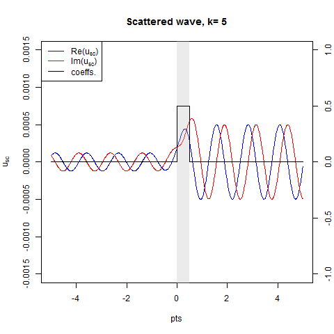

<script type="text/x-mathjax-config">
MathJax.Hub.Config({
  TeX: { 
      equationNumbers: {
            autoNumber: "all",
            formatNumber: function (n) {return n}
      } 
  }
});
</script>
```{r setup, include=FALSE}
knitr::opts_chunk$set(echo = TRUE)
```
\newcommand{\R}{\mathbb{R}}
\newcommand{\B}{\mathrm{B}}
\newcommand{\sc}{\mathrm{sc}}
\newcommand{\d}{\mathrm{d}}
\newcommand{\e}{\mathrm{e}}
\newcommand{\i}{\mathrm{i}}

(This page is created with R Markdown, see <a href="index.Rmd">index.Rmd</a>)

### Introduction

Let us consider the fourth order differential equation
$$
\frac{\d^4}{\d x^4}u(x) + (\alpha(x)u'(x))' + q(x)u'(x) + V(x)u(x) = k^4 u,\quad x\in \R,
$$
where the functions $\alpha,q$ and $V$ are called the coefficients of the equation and prime denotes differentiation with respect to $x$. This equation models, for example, vibration of beams and it appears also in study of elasticity.

For simplicity, let us put $\alpha=q=0$ in this text and consider the equation
$$
\frac{\d^4}{\d x^4}u(x) + V(x)u(x) = k^4 u
$$
with one potential function $V(x)$.

In what follows we develop the so called **scattering theory** for this equation and illustrate it with code examples in R. For more detailed scientific study of scattering for (1), see our paper [1] (subscription required) with V. Serov. In [3] we have treated the nonlinear Schrödinger equation in a similar manner.

### Direct scattering 

Suppose an **incident wave** $u_0(x)$ travels along the coordinate axis and meets the potential $V(x)$. Then a **scattered wave** $u_{\sc}$ is produced. The sum $u=u_0+u_{\sc}$ is called the total wave and it is to satisfy (2).

As incident waves we use the **plane wave** $u_0(x)=\e^{\i kx}$, where the parameter $k>0$ is called the **wave number**. The wave number is connected to **the wave length** as $\lambda=2\pi/k$. To stress the dependence on $k$ we denote
$$
u_0(x,k)=\e^{\i kx}.
$$
In time harmonic (monochromatic) context this represents a wave moving from left to right along the coordinate axis. Let us plot this in order to see its behaviour.

```{r plotincident}
k = 2
plot(function(x) Re(exp(1i*k*x)),-6,6,ylab='')
plot(function(x) Im(exp(1i*k*x)),-6,6,col='red',add=TRUE)
legend( x="topleft", legend=c("Re(u_0)", "Im(u_0)"),col=c("black","red"),lty=c(1,1))
```

This is the wave motion in free space without potential since $u_0(x,k)$ solves (2) with $V=0$ as is readily verified.


Next we proceed to solve (2) with potential $V(x)$ i.e. look for the sum of incident and scattered waves. It is reasonably straightforward to check that the function
$$
G_k^+(|x|)=\frac{\i \e^{\i k|x|}-\e^{-k|x|}}{4k^3}
$$
is a fundamental solution (see e.g. <a href="https://en.wikipedia.org/wiki/Fundamental_solution">Wikipedia</a>) of the differential operator
$$
\frac{\d^4}{\d x^4}-k^4.
$$
It means that a solution of (2) can be found as a solution of the integral equation
$$
u(x,k)=u_0(x,k) - \int_{-\infty}^\infty G_k^+(|x-y|)V(y)u(y,k)\d y.
$$
Here we have employed standard theory of differential operators with constant coefficients. The unique solution to (6) is obtained as the series
$$
u(x,k)=\sum_{j=0}^\infty u_j(x,k),
$$
where the iterations $u_j(x,k)$ are defined recursively from
$$
u_{j+1}(x,k)= - \int_{-\infty}^\infty G_k^+(|x-y|)V(y)u_j(y,k)\d y, \quad j=0,1,\ldots
$$
with $u_0(x,k)$ as above. Details of this are given in [1].

This completes the discussion on **direct scattering problem**: given potential $V(x)$ and incident wave $u_0(x,k)$ we are able to find the total wave function $u(x,k)$. In particular, the scattered wave is obtained.


### Inverse scattering  

Now, let us turn to the **inverse scattering problem**: find the potential $V(x)$ given information about the scattered wave far away. In order to make this more precise we must study the scattered wave for large arguments.

Under quite mild conditions on $V(x)$, namely $V\in L^1(\R)$, the space of integrable functions, we may obtain from (6) that the total wave behaves at large distances as

\begin{align}
u(x,k)&=a(k)\mathrm{e}^{\mathrm{i} kx} + o(1),\quad x\to\infty\\
u(x,k)&=\mathrm{e}^{\mathrm{i} kx}+b(k)\mathrm{e}^{-\mathrm{i} kx} + o(1),\quad x\to -\infty,
\end{align}

where $a(k)$ is called the **transmission coefficient**, $b(k)$ is called the **reflection coefficient** and $o(1)$ is a small term. The latter formulas are called **asymptotics** for $u$. Moreover, the coefficients are given by

\begin{align}
a(k)&=1+\frac{1}{4k^3}\int_{-\infty}^\infty \mathrm{e}^{-\mathrm{i} ky}V(y)u(y)\mathrm{d} y\\
b(k)&=-\frac{\mathrm{i}}{4k^3}\int_{-\infty}^\infty \mathrm{e}^{\mathrm{i} ky}V(y)u(y)\mathrm{d} y.
\end{align}

It turns out that $a(k)\approx 1$ for large $k$. Therefore we concentrate our attention to the reflection coefficient $b(k)$. If we substitute $u\approx u_0$ in the definition of $b(k)$ we obtain
$$
b(k)\approx-\frac{\i}{4k^3}\int_{-\infty}^\infty \e^{2\i k y}V(y)\d y.
$$
Here we recognize a **Fourier transform** (see <a href="https://en.wikipedia.org/wiki/Fourier_transform">Wikipedia</a>). Indeed, if we define the Fourier transform pair as

\begin{align}
Ff(\xi)=\frac{1}{\sqrt{2\pi}}\int_{-\infty}^\infty \mathrm{e}^{-\mathrm{i} x\xi}f(x)\mathrm{d} x\\
F^{-1}f(x)=\frac{1}{\sqrt{2\pi}}\int_{-\infty}^\infty \mathrm{e}^{\mathrm{i} x\xi}f(\xi)\mathrm{d}\xi
\end{align}

then
$$
b(k)\approx -\frac{\i\sqrt{2\pi}}{4k^3}(F^{-1}V)(2k).
$$
This suggests us to define a new quantity $V_\B$ by requiring equality here i.e.
$$
b(k)= -\frac{\i\sqrt{2\pi}}{4k^3}(F^{-1}V_\B)(2k).
$$
By Fourier inversion (see <a href="https://en.wikipedia.org/wiki/Fourier_inversion_theorem">Wikipedia</a>) formula we may reverse this to the form
$$
V_\B(x)= F\left(\frac{\i k^3}{2\sqrt{2\pi}}b(k/2)  \right )(x).
$$
The function $V_\B$ is called the **inverse Born approximation** of potential $V$.

We have proved in [1] that if $V$ is real-valued then
$$
V_\B-V \in H^s(\R) + \dot{C}(\R),\quad s<1/2,
$$
where $H^s(\R)$ denotes the Sobolev space (see <a href="https://en.wikipedia.org/wiki/Sobolev_space">Wikipedia</a>) with regularity index $s$ and $\dot{C}(\R)$ denotes continuous functions vanishing at infinity. Actually, in [2] stronger result $V_\B-V \in C^\alpha(\R) + C^\infty(\R),0<\alpha<1$ was obtained.

The latter result is useful to us in the following sense. Although $V\in L^1(\R)$ may contain local singularities, the difference $V_\B-V$ is more regular than $V$. In practical terms this means that the inverse Born approximation **carries essential information** about $V$. Namely, any local singularities of $V$ are recovered from $V_\B$ which is completely determined by the reflection coefficient $b(k)$, the data for our inverse problem, which in turn is determined from asymptotics of $u(x,k)$.


### Numerical Examples

Let us illustrate the foregoing theory by some numerical examples. We use the freely available <a href="https://www.r-project.org">R Language</a>. Our code consists of the main file (<a href="main.R">main.R</a>) and its utilities (<a href="util.R">util.R</a> and <a href="funcs.R">funcs.R</a>). To use these files, put all files in a same folder, start R (or RStudio) and set the working directory to the location of the files. Issuing the command <tt>source("main.R")</tt> will solve direct and inverse scattering problems with default parameters. The user may modify the problem (i.e. the potential) and also the parameters to see their effects.

Let's start walking through an example with code samples. In main file, we set an interval of interest to be $[-a,a]$ with $a=6$ and the support of $V$ to be $[0,0.5]$:

```{r a}
supp = c(0,0.5)
a = 6
```

We are mainly interested in recovering jumps so let us put $V$ as
```{r setV}
V<-function(x){
  idx <- 1*(supp[1] < x & x < supp[2] ) #characteristic function of "supp"
  return(.5*idx)
}
```
half of the characteristic function of interval $[0,0.5]$. This is done in <tt>funcs.R</tt>. The graph of $V$ can be plotted in main file as follows:

```{r plotV}
# issue source("funcs.R") before plotting
plot(V,-a,a,ylim=c(-1,1),n=800)
```

The iterations $u_j(x,k)$ are calculated using the composite Simpson qudrature rule (see <a href="https://en.wikipedia.org/wiki/Simpson's_rule">Wikipedia</a>) over the support of $V$, see e.g. Wikipedia. The weights and abscissas of $2n+1$ point composite Simpson rule are defined <tt>util.R</tt> over arbitrary interval $[a,b]$ as follows:

```{r defineSimpson}
simpson <- function(a,b,n){
  h = (b-a)/(2*n)
  x = seq(a,b,by=h)
  w = h*c(1,rep(c(4,2),n-1),4,1)/3
  return(matrix(c(x,w),2,byrow=TRUE))
}
```

The abscissas and weights are on the first and second rows of the returned matrix, respectively. For example (transposed here for the purpose of illustration):
```{r callSimpson}
#issue source("util.R") before calling simpson
t(simpson(0,1,10))
```

Given these weights and abscissas in matrix $M1$ (which can be precomputed just once and used multiple times) the iterations $u_j(x,k)$ are defined <tt>funcs.R</tt> as:

```{r defineUj}
u_0<-function(x,k){
  return(exp(1i*k*x))
}
u_j<-function(x,k,j,M1){
  
  if(j==0){ return(u_0(x,k)) }else{
    G <- function(x,k){
      return( -1/(4*k^3)*(1i*exp(1i*k*abs(x)) - exp(-k*abs(x))) )
    }
    f<-function(x,y){
      return( t(G( outer(x,y,"-") ,k ))*V(y)*u_j(y,k,j-1,M1) ) #to use *-product of vectors, we need transpose of G
    }
    return( colSums(M1[2,]*f(x,M1[1,])) )
  }
}
```

The total wave $u(x,k)$ is defined also in <tt>funcs.R</tt> as a finite sum. Adding more terms makes computation more accurate but slower also.
```{r defineU}
u<-function(x,k) u_0(x,k) + u_j(x,k,1,M1) + u_j(x,k,2,M1) + u_j(x,k,3,M1) + u_j(x,k,4,M1) #+ u_j(x,k,5,M1)
```

Here is how the scattered wave $u-u_0$ looks like (gray area indicates the location of support of $V$):
```{r plotUsc}
M1 <- simpson(supp[1],supp[2],128)
k = 2
plot(function(x) Re(u(x,k)-u_0(x,k)),-a,a,ylab="")
plot(function(x) Im(u(x,k)-u_0(x,k)),-a,a,col='red',add=TRUE,ylab="")
polygon(c(0,0,0.5,0.5),c(-10,10,-10,10),col = adjustcolor("gray", alpha=0.5), border = NA)
```


The animation below (created with <a href="anim.R">anim.R</a>) depicts the scattered wave solved from the time-dependent version of (1).
</br>
</img>


Next we define the reflection coefficient $b(k)$ in <tt>util.R</tt> using the asymptotics (10) at $x=-10^6$: (parallel version of this is provided as bfun2())
```{r defineB}
bfun<-function(k){
  f<-function(kk) exp(-1i*kk*1e6)*( u(-1e6,kk) - u_0(-1e6,kk) )
  return(vapply(k,f,FUN.VALUE=complex(real=0,imaginary=0)))
}
```
Note that we use synthetic data in our example: given $V$ we find $u(x,k)$ and then $b(k)$. Getting real data would require setting up a physical measurement device.

For the numerical computation of $V_\B(x)$ it suffices to calculate
$$
f(x)=\int_0^\infty \e^{-\i kx}k^3b(k/2)\d k
$$
since 
$$
V_\B(x)=-\frac{\mathrm{Im}\; f(x)}{2\pi}.
$$
By Fourier inversion we have
$$
\int_{-\infty}^\infty \e^{\i kx}f(x)\d x = 2\pi k^3b(k/2).
$$
The unknown $f$ is represented in discrete form
$$
f(x)=\sum_{j=1}^N f_j\phi_j(x),
$$
where $f_j=f(x_j)$ are the unknown values of $f$ on a uniform grid $x_j=a+(j-1)(b-a)/(N-1)$ and $\phi_j(x)$ are the known hat functions
$$
\phi_j(x)=\begin{cases}
\dfrac{x-x_{j+1}}{x_j-x_{j+1}},& x_j\le x \le x_{j+1}\\
\dfrac{x-x_{j-1}}{x_j-x_{j-1}},& x_{j-1}\le x \le x_{j}\\
0,& \text{otherwise}
\end{cases}
$$
on the same grid.

These hat functions are defined in <tt>util.R</tt> as:
```{r defineHat}
hat_j<-function(x,j,a,b,N){
  xj<-function(j) a+(j-1)*(b-a)/(N-1)
  fx <-function(x,j){
    ifelse(x >= xj(j) & x <xj(j+1), (x-xj(j+1))/(xj(j)-xj(j+1)),
    ifelse(x >= xj(j-1) & x < xj(j),  (x-xj(j-1))/(xj(j)-xj(j-1)),
           0))
  }
  return(outer(x,j,fx)) #returns a (length(x) by j)-matrix, with different colums corresponding to j:s
}
```

Let's plot a few of them:
```{r plotHats}
N = 20
plot(function(x) hat_j(x,1,-a,a,N),-a,a,n=400,ylab='')
plot(function(x) hat_j(x,8,-a,a,N),-a,a,add=TRUE,n=400)
plot(function(x) hat_j(x,16,-a,a,N),-a,a,add=TRUE,n=400)
plot(function(x) hat_j(x,N,-a,a,N),-a,a,add=TRUE,n=400)
```

Substituting the discrete form of $f$ into (22) yields
$$
\sum_{j=1}^N f_j\int_{x_{j-1}}^{x_{j+1}} \e^{\i kx}\phi_j(x)\d x = 2\pi k^3b(k/2),
$$
where the integrals can be computed easily in closed form. We give the final result as an R function in <tt>util.R</tt>:

```{r defineHatInt}
hat.int <- function(k,a,b,n,j){
	h<-(b-a)/(n-1)
	x<- a + (j-1)*h
	
	if(j==1){
	  return(  exp(1i*k*a)*(1-exp(1i*k*h)+1i*k*h)/h/k^2) 
	  }
	else if(j==n){
	  return(  exp(1i*k*b)*(1-exp(-1i*k*h)-1i*k*h)/h/k^2) 
	}
	else
	{
	  return(exp(1i*k*x)/(h*k^2)*(2-exp(-1i*k*h)-exp(1i*k*h)))
  }
}
```


Evaluating (25) at several $k$ points we obtain a linear system $Af=g$ for the unknown values $f_j$. The right hand side is
$$
g(k)= 2\pi k^3b(k/2)
$$
and it is evaluated at $M=300$ points uniformly in the interval $[1,140]$. Here we compute the data and plot it. (this and subsequent code in main file)
```{r compData}
M <- 300
g <- function(k) 2*pi*k^3*bfun(k/2)
kk = seq(1,140,by=(140-1)/(M-1))
gval = g(kk)
k0 =  integrate(function(x) abs(V(x)), -a,a)$value
gval[kk <= 2*k0] = 0
plot(kk,Re(gval),type='l',xlab='k',ylab='',ylim=c(-5,3))
lines(Im(gval),type='l',col='red')
legend( x="topright", legend=c("Re g(k)", "Im g(k)"),col=c("black","red"),lty=c(1,1))
```

We add 1% of white noise to data in order to test our method for noise robustness.
```{r addNoise}
sigma = 0.01 # std of noise is sigma*max(abs(g))
gval = gval +  rnorm(length(gval), mean=0, sd=sigma*max(abs(gval))) +  1i*rnorm(length(gval), mean=0, sd=sigma*max(abs(gval)))
```


The coefficient matrix of our linear system is given by: 
```{r defineA}
N = 400
A <- matrix(0,M,N)	
for(i in 1:M){
	for(j in 1:N){
		A[i,j] <- hat.int(kk[i], -a, a, N, j )
  }
}
```

This is ill-conditioned matrix 
```{r condA}
rcond(A)
```
and hence regularization methods are needed to solve for $f$.

We employ the **truncated singular value decomposition** (TSVD) method. To that end, we start from the singular value decomposition $A=USV^\ast$ (see <a href="https://en.wikipedia.org/wiki/Singular_value_decomposition">Wikipedia</a>) and inspect the singular values in logarithmic scale:
```{r svdA}
s <- svd(A)
plot(s$d,log="y",ylab="Singular values",type="p",cex=0.5)    
```

In this graph we witness the sudden drop in singular values as expected. To regularize, we omit singular values less than $0.3$ and write the regularized solution as
$$
f = VLU^\ast g
$$
where $U$ and $V$ are as above and $L=\mathrm{diag}(1/s_1,\ldots,1/s_r,0,\ldots,0)$ with $s_r$ being the last singular value exceeding $0.3$.
```{r solveReco}
stol <- 0.3
s$d[s$d < stol] <- 0	# truncation: replace small singular values by 0
L <- 1/diag(s$d)      # diagonal matrix consisting of reciprocals of singular values
L[L == Inf] <- 0	    # fill with zeros
fj <- s$v %*% L %*%  Conj( t(s$u) ) %*% gval #regularized solution f
```

Having found $f_j$'s we may obtain $f(x)$ and finally $V_\B(x)$.

```{r compV_b}
V_b <- function(x) -1/(2*pi)*Im(c(hat_j(x,1:N,-a,a,N)%*%fj))
```

Plotting the graphs of $V$ and $V_\B$ is as easy as
```{r plotReco}
plot(V_b,-a,a, type="l", xlab="x", col="red", ylab="", ylim=c(-4,4), n=600)
curve(V,add=TRUE,n=600,col="black")
title("Reconstruction")
legend( x="topleft", legend=c("V", "V_B"),col=c("black","red"),lty=c(1,1))
```

We see that the inverse Born approximation indeed recovers jumps of potential $V$ quite accurately.

### References
[1] Tyni T,  Harju M and Serov V, <a href="http://iopscience.iop.org/article/10.1088/0266-5611/32/7/075001">*Recovery of singularities in a fourth-order operator on the line from limited data*</a>, Inverse Problems, 32 (2016),  075001.

[2] Tyni T, <a href="http://jultika.oulu.fi/Record/nbnfioulu-201505091502">*Direct and inverse scattering problems for operator of order 4 on the line*</a>, MSc. thesis, University of Oulu (2015)

[3] Harju M and Fotopoulos G, <a href="http://dx.doi.org/10.1515/cmam-2014-0006">*Numerical solution of direct and inverse scattering problems in 1D with a general nonlinearity*</a>, Computational Methods in Applied Mathematics, 14 (2014), 347-359.


